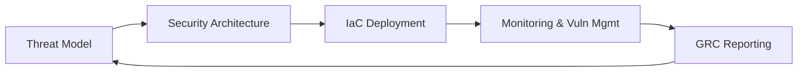

# Hey, I'm [Your Name] 👋

> **IT Infrastructure & Cloud Security Specialist** — securing systems, architecting resilience, and automating everything in between.

---

## 🛡️ Security Focus

- **Security Architecture & Threat Modeling** — designing systems with security baked in, not bolted on
- **Risk Management & GRC** — governance, compliance, and risk frameworks that actually make sense
- **Cloud Security Governance** — policy, posture, and guardrails for cloud-native environments
- **AI Guardrails** — building responsible boundaries around AI systems
- **Vulnerability Management** — finding and fixing before the bad guys do

---

## 🖥️ Infrastructure & Systems

- System & network administration across hybrid environments
- Virtualisation, containers, and cloud platforms
- Comfortable in **Linux** and **Windows** — whichever gets the job done
- Strong mental model of how systems actually work, end to end

---

## 🤖 Automation & AI

- **Vibe coding** — pragmatic, AI-assisted development
- **AI prompt engineering** — getting the most out of LLMs for real-world tasks
- Automation-first mindset across infra and security workflows

---

## 🧰 Tools & Languages

```text
Languages     Python · PowerShell · Bash
IaC / Config  Ansible · Terraform
Docs as Code  Markdown · HTML · Mermaid Diagrams
```

---

## 📐 Docs as Code

I treat documentation like infrastructure — versioned, structured, and maintainable.  
Diagrams live in code. Runbooks live in repos.



---

## 📌 What You'll Find Here

- 🔐 Security tooling, scripts, and automation
- ☁️ Cloud security configs and governance templates
- 🏗️ Infrastructure-as-code patterns
- 📄 Documentation templates and diagram-as-code examples

---

*"Security is not a product, but a process."* — Bruce Schneier

---

📫 How to reach me - https://daredumidu.weebly.com/

## Micro Credentials: 
- https://www.credly.com/users/daredumidu/badges
- https://www.credential.net/profile/daredumidu/wallet
- https://learn.microsoft.com/en-us/users/daredumidu/

---

<!---
daredumidu/daredumidu is a ✨ special ✨ repository because its `README.md` (this file) appears on your GitHub profile.
You can click the Preview link to take a look at your changes.
--->
